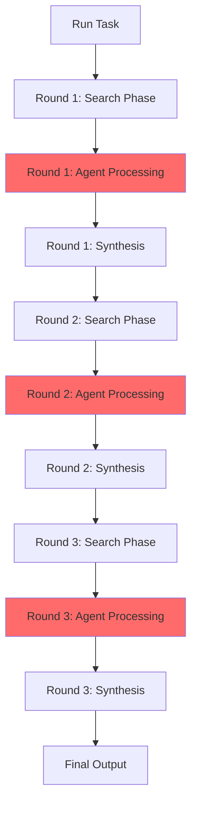

# AGENT ARCHITECTURE - QUICK REFERENCE

## Current Execution Model



**Red = Bottleneck** (Agent Processing phases are LLM-limited)

---

## Agent Dependencies & Triggering

```
TIME →

Scouts        [Active immediately - no dependencies]
              ↓ deposit INITIAL signals
              
Foragers      [Event-driven - wait for INITIAL]
              ↓ deposit SUPPORT/CRITIQUE signals
              
Critics       [Event-driven - wait for any signals]
              ↓ deposit CRITIQUE signals + adjust strength
              
Haters        [Active - sample strong/consensus signals]
              ↓ deposit OBJECTION signals
              
Validators    [Active - sample factual claims]
              ↓ deposit VERIFICATION + adjust strength
              
Pruners       [Active - cleanup weak signals]
              
Environment   [Periodic - decay & prune]

All run concurrently but BLOCKED by shared LLM
```

---

## Bottleneck Analysis

| Component | Time % | Parallelizable? | Optimization Impact |
|-----------|--------|-----------------|---------------------|
| **LLM Generation** | 85% | ❌ → ✅ | 🔴 **CRITICAL** (3-5x speedup) |
| Semantic Search | 10% | ✅ | 🟡 MEDIUM (1.2x speedup) |
| Provenance Traversal | 3% | ✅ (cached) | 🟢 LOW (already optimized) |
| Signal Store Lock | 1% | N/A | 🟢 NEGLIGIBLE |
| Other | 1% | ✅ | 🟢 NEGLIGIBLE |

---

## Optimization Priorities

### 🏆 PHASE 1: Quick Wins (1-2 days) → 1.4x speedup
- [ ] Background embedding computation
- [ ] Reduce synthesis prompt size
- [ ] Profile to confirm bottlenecks

### 🎯 PHASE 2: LLM Batching (1 week) → 3x speedup
- [ ] Implement batch collection layer
- [ ] Coordinate multi-agent prompts
- [ ] Handle temperature variations

### 🚀 PHASE 3: Multi-Instance (1 week) → 5x speedup
- [ ] Create LLM pool (4 instances)
- [ ] Distribute agents across pool
- [ ] Load balancing

---

## Architecture Comparison

### Current (Sequential LLM)
```
Agent1 ─┐
Agent2 ─┼─→ [LLM Queue] → [Generate] → Results
Agent3 ─┤   (sequential)   (1-3s each)
Agent4 ─┘

Timeline: |1s|1s|1s|1s| = 4 seconds for 4 agents
```

### Optimized (Parallel LLM)
```
Agent1 ──→ [LLM1] ─┐
Agent2 ──→ [LLM2] ─┼→ Results (parallel)
Agent3 ──→ [LLM3] ─┤
Agent4 ──→ [LLM4] ─┘

Timeline: |1s| = 1 second for 4 agents (4x speedup)
```

---

## Key Files for Optimization

| File | Lines | Bottleneck | Change Needed |
|------|-------|------------|---------------|
| `simple_llm.py` | ~200 | LLM singleton | Add batching or pooling |
| `signal_store.py` | 1410 | Embeddings | Background worker |
| `synthesizer.py` | 206 | Large prompts | Truncate context |
| `run_task.py` | 975 | Sequential rounds | Pipeline overlap |

---

## Expected Performance

| Optimization Level | Time/Round | Total (3 rounds) | Speedup |
|-------------------|------------|------------------|---------|
| Current | 70-100s | 210-300s | 1.0x |
| Phase 1 (Quick) | 50-70s | 150-210s | **1.4x** |
| Phase 2 (Batch) | 25-35s | 75-105s | **3.0x** |
| Phase 3 (Multi) | 15-25s | 45-75s | **5.0x** |

**Target:** Sub-60 second execution (currently ~4-5 minutes)

---

## Critical Insights

1. **Architecture is EXCELLENT for coordination**
   - Event-driven (no polling waste)
   - Stigmergic (clean agent separation)
   - Lock-free where possible

2. **Architecture is POOR for compute efficiency**
   - Single LLM instance (all agents wait)
   - No batching (GPU underutilized)
   - Sequential token generation

3. **The fix is NOT redesigning the swarm**
   - Don't change agent logic
   - Don't change signal store
   - Don't change coordination
   - **Just parallelize the LLM**

---

## Recommended First Step

**Start with Phase 1** (1-2 days work):
1. Measure current performance with profiling
2. Move embeddings to background worker
3. Reduce synthesis prompt length
4. Confirm 1.4x speedup

Then decide on Phase 2 (batching) vs Phase 3 (multi-instance) based on:
- GPU memory available (multi-instance needs 4x memory)
- Complexity tolerance (batching is more complex code)
- Speedup target (batching: 3x, multi-instance: 5x)
